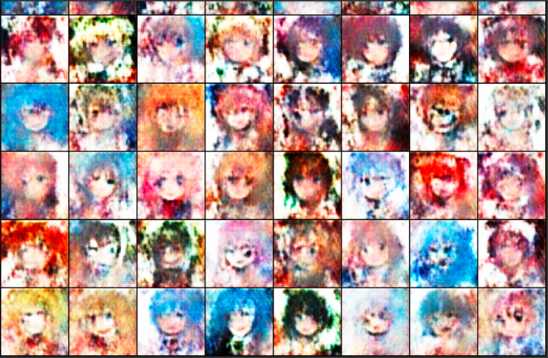

# Simple pytorch implementation of cartoon-GAN

* Project for learning
* Ideas mostly borrowed from: https://github.com/znxlwm/pytorch-CartoonGAN
* Dataset: https://drive.google.com/open?id=1bXXeEzARYWsvUwbW3SA0meulCR3nIhDb

* Result: 
> 1. Adam optimizer for generator and discriminator (learning rate = 0.0002, betas = (0.5, 0.999))
> 2. BCE-Loss
> 3. Batch-size: 64. Epochs: 80 (colab time error at epoch-61)
> 4. Result is still bad so definitely train again in the future

